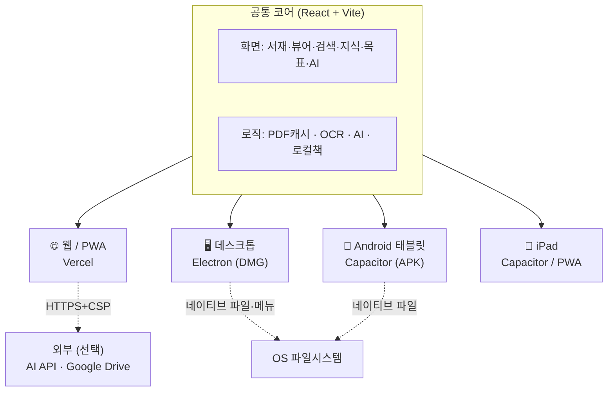
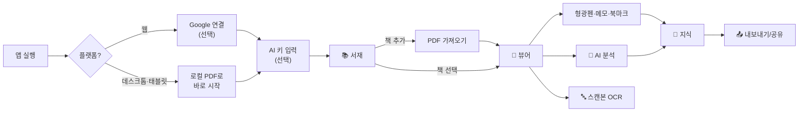
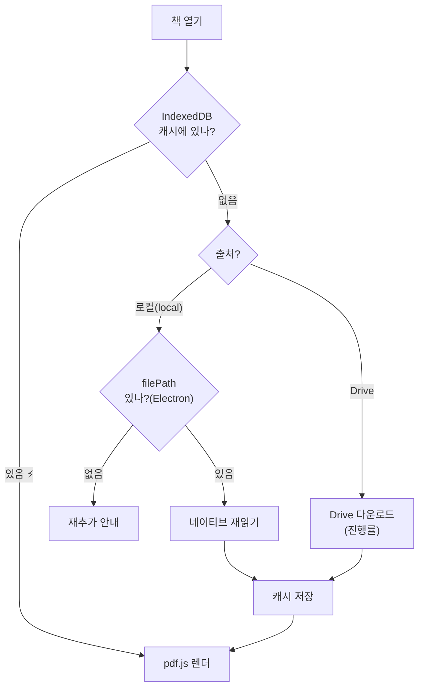
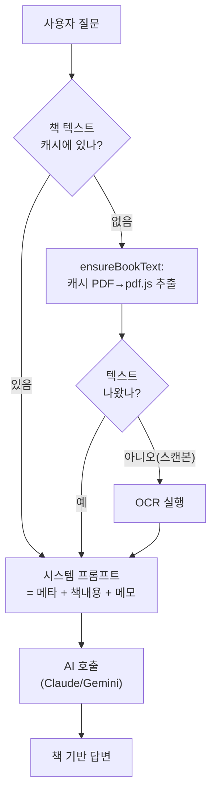
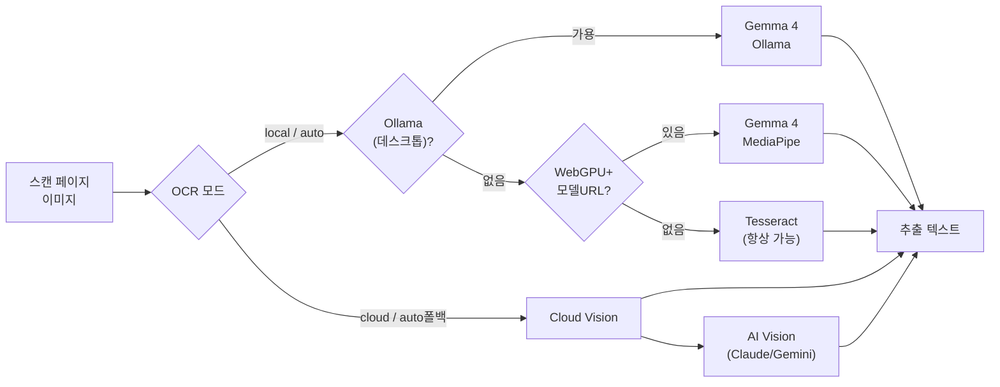
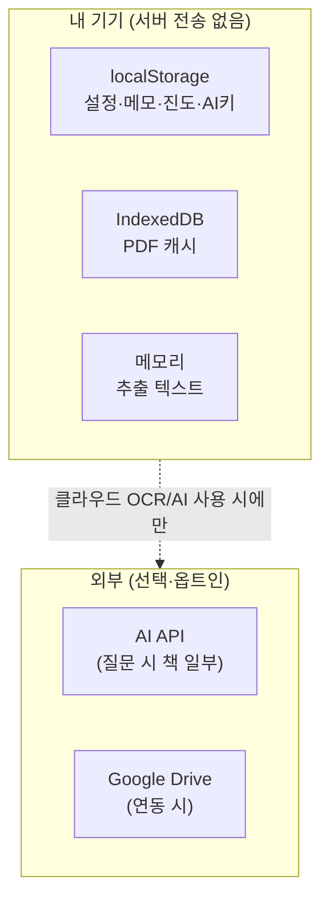
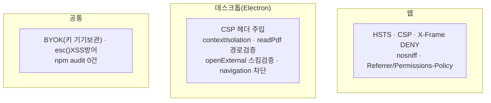
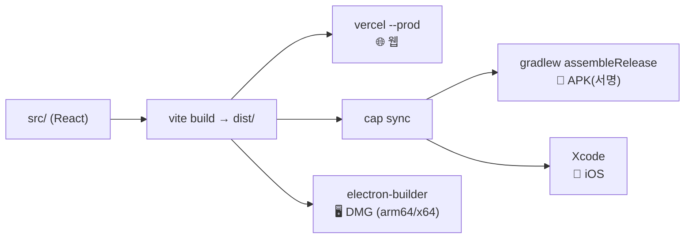

# PKL 아키텍처 & 플로우 다이어그램

> 시각 자료 모음. GitHub·VS Code 등 **Mermaid를 렌더하는 뷰어**에서 다이어그램이 그림으로 보입니다.
> 버전 1.0.0 · 2026-06-07

---

## 1. 전체 구조 — 하나의 코드, 4개 플랫폼

**핵심 원칙**: 같은 React 코드를 4개 플랫폼이 공유. 플랫폼 차이(`isElectron`/`isCapacitor`)는 런타임 분기로 흡수.

---

## 2. 사용자 여정 (온보딩 → 읽기 → 지식)

---

## 3. 책 로딩 — 캐시 우선 (로컬 & Drive 공통)

> 한 번 연 책은 IndexedDB에 캐시 → 다음부터 네트워크 없이 즉시.

---

## 4. AI 분석 — 책 텍스트 보장 파이프라인

> 뷰어를 안 거쳐도, 앱을 재시작해도 **AI가 항상 책 내용 기반**으로 답하도록 보장.

---

## 5. OCR provider 체인 (로컬 우선)

| 우선 | 엔진 | 플랫폼 | 품질 | 위치 |
|:--:|------|--------|:--:|------|
| 1 | Gemma 4 (Ollama) | 데스크톱 | ★★★★★ | 로컬 |
| 2 | Gemma 4 (MediaPipe/WebGPU) | 웹·태블릿 | ★★★★★ | 로컬 |
| 3 | Tesseract.js | 전부 | ★★★★ | 로컬 |
| 4 | Cloud Vision / AI Vision | 전부 | ★★★★★ | 클라우드 |

---

## 6. 데이터 저장 위치 (프라이버시)

> 기본은 **전부 기기 내부**. 클라우드는 사용자가 선택한 기능에서만 작동.

---

## 7. 보안 계층

---

## 8. 빌드·배포 파이프라인

| 명령 | 산출물 |
|------|--------|
| `npm run build` + `vercel --prod` | 웹 |
| `npm run electron:build` | macOS DMG |
| `npm run cap:apk:release` | 서명된 Android APK |
| `npm run cap:ios` | Xcode 프로젝트 |
