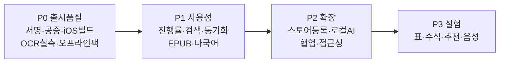

# PKL 향후 개발 로드맵

> 현재 1.0.0에서 **구현 완료**된 것과 **앞으로 개발이 필요한** 항목 정리.
> 2026-06-07 기준.

---

## ✅ 현재 구현 완료 (1.0.0)

| 영역 | 상태 |
|------|------|
| 멀티플랫폼 | 웹/PWA · 데스크톱(DMG) · Android(서명 APK) · iOS(Capacitor 프로젝트) |
| 책 소스 | 내 기기 PDF(오프라인 캐시) · Google Drive |
| 뷰어 | 페이지·확대·형광펜·북마크·집중모드·단어뜻 |
| AI 분석 | 책 텍스트 기반 답변 보장(ensureBookText) · 3모드 |
| 로컬 OCR | Tesseract · Gemma 4(Ollama) · Gemma 4(MediaPipe/WebGPU) · Cloud Vision |
| 지식 | 메모·하이라이트·AI 어휘·퀴즈·복습카드·내보내기 |
| 보안 | 웹/데스크톱 CSP · IPC 검증 · Android 릴리스 서명 |
| 테스트 | 658개 통과 |

---

## 🔭 향후 개발 필요 항목

### P0 — 출시 품질에 중요 (우선)

| 항목 | 현재 한계 | 해야 할 일 |
|------|-----------|-----------|
| **macOS 코드 서명·공증** | ad-hoc 서명 → 첫 실행 시 "우클릭 열기" 필요 | Apple Developer($99/년) 인증서로 서명+notarize |
| **iOS 실기기 빌드** | Capacitor 프로젝트만 존재 | Xcode + Apple 계정으로 빌드·TestFlight |
| **OCR 실측 검증** | provider 로직만 단위테스트 | 실제 스캔본·WebGPU 기기에서 Gemma 4 정확도/속도 측정 |
| **Tesseract 완전 오프라인** | 언어팩 첫 1회 CDN 다운로드 | `public/tessdata/` self-host + `langPath` 설정 |
| **에러 UX 통일** | 일부 실패 시 콘솔/토스트 제각각 | 공통 에러 토스트·재시도 UI |

### P1 — 사용성 향상

| 항목 | 설명 |
|------|------|
| **OCR 진행률 UI** | 페이지별 OCR 진행 표시(특히 Gemma 첫 로드 수십초) |
| **Gemma 모델 다운로드 헬퍼** | 모델 URL 수동 입력 대신 앱 내 다운로드·캐시 관리 |
| **검색 고도화** | 현재 메타 중심 → 전문(full-text) 검색, 하이라이트 점프 |
| **동기화** | localStorage 기반 → 기기 간 메모·진도 동기화(Drive/계정) |
| **EPUB 지원** | 현재 PDF만 → EPUB 리더 추가 |
| **다국어 UI** | 한/영 → 일/중 등 확장 (OCR은 이미 다국어) |

### P2 — 확장·플랫폼

| 항목 | 설명 |
|------|------|
| **Windows/Linux 정식 배포** | electron-builder 타깃은 있으나 서명·검증 미완 |
| **Play 스토어 / App Store 등록** | 스토어 메타·심사·AAB 빌드 |
| **iOS 네이티브 파일 연동** | Files 앱 통합, 공유 시트로 PDF 받기 |
| **오프라인 AI(텍스트)** | OCR뿐 아니라 요약·질의도 로컬 LLM(Gemma)로 |
| **협업·공유 강화** | 책별 노트 공유, 읽기 그룹 |
| **접근성(a11y)** | 스크린리더·키보드 내비·고대비 |

### P3 — 연구·실험

| 항목 | 설명 |
|------|------|
| **표·수식 구조화 추출** | Gemma VLM으로 표→마크다운, 수식→LaTeX |
| **자동 챕터·목차 생성** | 텍스트 기반 구조 추론 |
| **개인화 추천** | 읽기 이력 기반 다음 책·복습 시점 추천 |
| **음성**(Gemma 오디오) | 오디오 입력 멀티모달 활용(낭독·받아쓰기) |

---

## ⚠️ 알려진 제약 (문서화)

- **Gemma 브라우저 OCR**: WebGPU 필수 + 모델 수 GB → 첫 로드 느림, 저사양 기기 부담. 옵트인.
- **데스크톱 OAuth**: Google 데스크톱 클라이언트 ID 별도 발급 필요(웹 ID 불가).
- **Android 릴리스 키스토어**: 분실 시 동일 앱 업데이트 불가 → 안전 백업 필수.
- **API 키 평문 저장**: BYOK 구조상 기기 localStorage 저장(서버 미전송). 고보안 요구 시 OS 키체인(safeStorage) 연동 검토 P2.

---

## 우선순위 요약 (시각)

